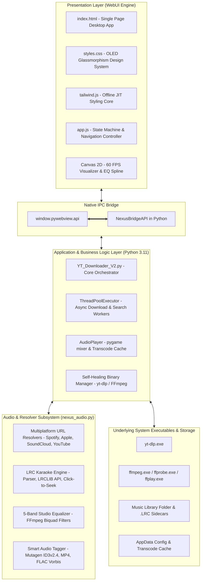
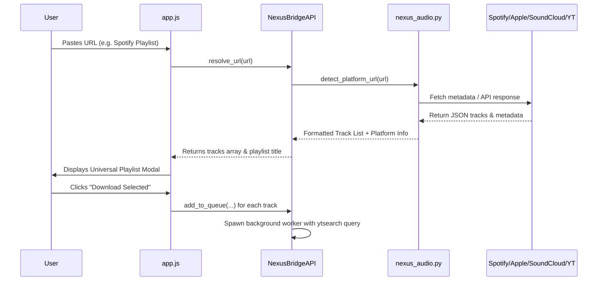

# NexusTube — Technical Architecture & Systems Engineering

> Next-Gen Studio Desktop Music Suite Architecture
> Author: by herlove | Version: 3.2.0

---

## 1. High-Level Architectural Topology

NexusTube utilizes a hybrid **Native Python Engine + Modern Web Frontend** architecture connected through **Microsoft Edge WebView2 (`edgechromium`) via `pywebview` IPC**.



---

## 2. Layer Specifications

### 2.1 Presentation Layer (`web/`)
- **Self-Contained & 100% Offline**: Contains no external CDN scripts or remote stylesheet dependencies. All styles, fonts, and scripts reside locally within `web/`.
- **OLED Dark Glassmorphism Design System**:
  - Base background: `#030307` (pure OLED black).
  - Surface cards: `rgba(255, 255, 255, 0.03)` with `backdrop-filter: blur(14px)`.
  - Dynamic Accent Theme System: 6 live user-switchable accent palettes (`#22C55E`, `#6366F1`, `#EC4899`, `#06B6D4`, `#F59E0B`, `#A855F7`).
  - Specular lighting and mouse-tracking spotlight effects (`--mx`, `--my` updated on 60 FPS `requestAnimationFrame`).
- **Dynamic 16-Bar Spectrum Visualizer**:
  - Synthesized FFT spectrum animation running in a 60 FPS rAF loop with organic decay, reactive to player state, playback position, and volume.
- **Interactive Equalizer Spline**:
  - Live HTML5 Canvas bezier spline plotting frequency gains across 60Hz, 250Hz, 1kHz, 4kHz, and 12kHz bands in real-time.

### 2.2 IPC & Bridge Layer (`NexusBridgeAPI`)
- **Zero-Latency Two-Way Communication**:
  - Python registers `NexusBridgeAPI` instance as the JS API handler on `webview.create_window()`.
  - JavaScript invokes Python methods through `await window.pywebview.api.<method_name>(...args)`.
- **Thread Safety & Background Worker Decoupling**:
  - Heavy I/O (video metadata resolution, YouTube searches, yt-dlp execution) is dispatched to a Python `ThreadPoolExecutor(max_workers=4)`.
  - The UI remains completely non-blocking and responsive during downloads and streaming.
- **Reactive State Polling**:
  - `app.js` runs a smooth 300ms polling loop (`startPollingLoop()`) querying player position and queue task progress without UI jank.

### 2.3 Audio Processing & Playback Engine (`nexus_audio.py`)
- **Playback Architecture**:
  - Built on `pygame.mixer.music` for ultra-low latency playback of standard WAV and MP3 formats.
  - Non-native formats (M4A/AAC, Opus, FLAC, OGG) are automatically transcoded on-demand into an isolated temporary cache using `ffmpeg`, ensuring seamless playback of any downloaded media.
- **5-Band Equalizer Engine**:
  - Applies 5 precision biquad peaking equalizer filters:
    - **Band 1**: `equalizer=f=60:width_type=o:w=1.0:g={bass}`
    - **Band 2**: `equalizer=f=250:width_type=o:w=1.0:g={low_mid}`
    - **Band 3**: `equalizer=f=1000:width_type=o:w=1.0:g={mid}`
    - **Band 4**: `equalizer=f=4000:width_type=o:w=1.0:g={high_mid}`
    - **Band 5**: `equalizer=f=12000:width_type=o:w=1.0:g={treble}`
  - Safety gain clamping ensures values stay strictly within `[-15.0 dB, +15.0 dB]` to prevent clipping.

### 2.4 Multi-Platform Universal URL Resolver Pipeline


---

## 3. Directory Layout & Runtime Paths

| Component | Path on Windows | Description |
| :--- | :--- | :--- |
| **Executable** | `C:\Users\Administrator\Downloads\NexusTube\NexusTube.exe` | Compiled standalone binary |
| **Engine Binaries** | `%APPDATA%\YTDownloaderPro\` | Location of `yt-dlp.exe`, `ffmpeg.exe`, `ffprobe.exe` |
| **Configuration** | `%APPDATA%\YTDownloaderPro\config.json` | JSON storing accent color, output directory, format preference |
| **Transcode Cache** | `%TEMP%\NexusTube_Cache\` | Temporary transcoded audio files cleaned up on exit |
| **Music Library** | User defined (Default: `%USERPROFILE%\Downloads\NexusTube`) | Downloaded audio/video files and `.lrc` lyrics |

---

## 4. Verification & Testing Framework

The project includes an automated test harness covering 74 unit and integration tests across two test modules:
- `tests/test_nexus_tube.py`: Tests audio decoders, metadata sanitizers, LRC parser, ID3 tagging, 5-band EQ filters, and platform resolvers.
- `tests/test_nexus_bridge.py`: Tests bridge initialization, IPC methods, queue lifecycle, thumbnail propagation, bilingual dictionaries, and WebUI asset integrity.

Execution command:
```powershell
pytest -v tests/
```
All 74 tests run hermetically without external network dependencies by using mock responses and temporary directories.
